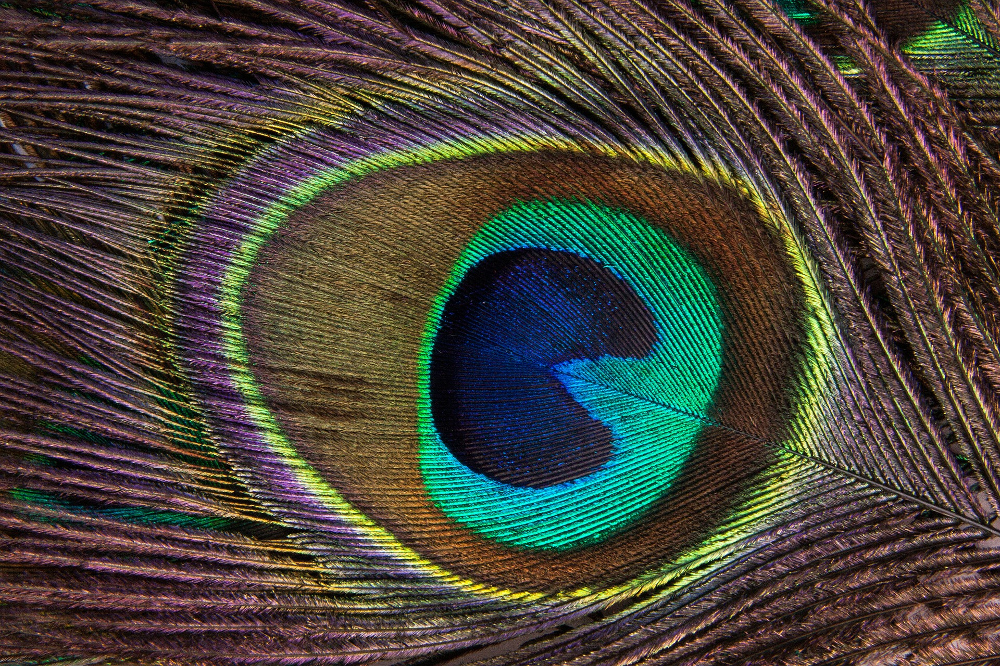

## Hi. My name is Savik.

I'm currently a 2nd year undergraduate student at Columbia University where I'm studying Computer Science and Mathematics. 

Navigate to the relevant pages to learn more about me.

Now here's a mesmerizing picture to fill up the rest of this page.

If you're not mesmerized, I apologize. 

Lastly, you can find my github repo [here](https://github.com/skfile) filled with some of my projects.
